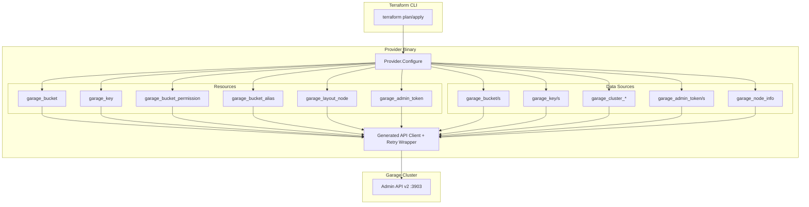
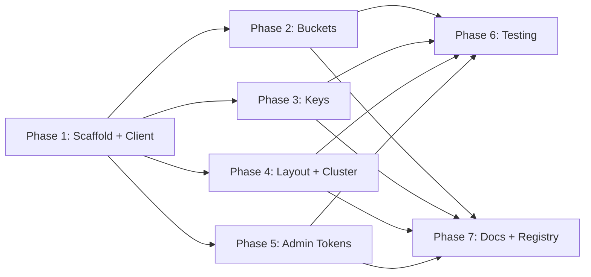

# Plan: terraform-provider-garage — Master Plan

A Terraform provider for [Garage](https://garagehq.deuxfleurs.fr/) S3-compatible object storage. Manages buckets, access keys, permissions, cluster layout, and admin tokens declaratively via Terraform configuration.

## Table of Contents

- [Context](#context)
- [Scope](#scope)
- [Garage Admin API v2 — Full Coverage Map](#garage-admin-api-v2--full-coverage-map)
- [Architecture Overview](#architecture-overview)
- [Implementation Phases](#implementation-phases)
- [Implementation Order](#implementation-order)
- [Acceptance Criteria](#acceptance-criteria)
- [Open Questions](#open-questions)

## Context

The Garage ecosystem needs a production-quality Terraform provider. There are 11+ providers on the Terraform Registry but none deliver full API coverage with production-grade engineering:

- **jkossis/garage** (112K downloads, v1.0.4) — 3 resources, 1 data source, hand-rolled client, no retries, silent key update bug, stale 5 months. Downloads driven by being first, not quality.
- **Arsolitt/garagehq** (88 downloads, v1.1.0) — 5 resources, 0 data sources. Has CI but code quality is poor: deprecated SDKv2 (not plugin-framework), all source files dumped in package root (no `internal/` structure), hand-rolled client, Protocol v5. No acceptance tests despite having a CI pipeline.
- **d0ugal/garage** (355 downloads, v0.2.0) — 3 resources, 0 data sources, API v1 (not v2), active
- Others: dead, archived, or forks with minimal changes

**Bottom line:** No competitor uses plugin-framework, none have proper project structure, none have acceptance tests, none have generated API clients, and none cover layout or admin tokens. The market is wide open.

See: [Existing provider analysis](../research/terraform-provider-analysis.md) | [ADR-006](../decisions/ADR-006-terraform-provider-scope.md)

This provider will deliver:

- **Full API coverage** — 34 of 49 operations mapped to 6 resources + 10 data sources
- **Generated API client** — From the official Garage OpenAPI v2.2.0 spec via oapi-codegen
- **Modern framework** — terraform-plugin-framework v1 (Protocol v6), not deprecated SDKv2
- **Proper project structure** — `internal/garage/`, `internal/provider/`, clean Go module layout
- **Proper HTTP client** — Configurable timeouts, exponential backoff retry, URL encoding
- **Validators everywhere** — Catch errors at plan time, not apply time
- **135+ tests** — 36 unit tests, 95 acceptance tests, 4 E2E workflows, all in CI
- **Working CI** — Containerized Garage in GitHub Actions, race detector, coverage
- **Terraform Registry** — Automated publishing via GoReleaser

## Scope

### In Scope

**Resources (6):**

| Resource | Description |
|---|---|
| `garage_bucket` | S3 bucket lifecycle: create, quotas, website hosting, aliases |
| `garage_key` | Access key lifecycle: create, import predefined creds, update name |
| `garage_bucket_permission` | Per-key permissions on a bucket (read/write/owner) |
| `garage_bucket_alias` | Global and local aliases for buckets (separate from bucket lifecycle) |
| `garage_layout_node` | Node role in cluster layout (zone, capacity, tags) with two-phase apply |
| `garage_admin_token` | Admin API token lifecycle |

**Data Sources (10):**

| Data Source | Description |
|---|---|
| `garage_bucket` | Look up bucket by ID or global alias |
| `garage_buckets` | List all buckets |
| `garage_key` | Look up key by ID |
| `garage_keys` | List all keys |
| `garage_cluster_health` | Cluster health metrics (nodes, partitions, quorum) |
| `garage_cluster_status` | Cluster info (version, features, nodes) |
| `garage_cluster_layout` | Current layout (version, node roles, staged changes) |
| `garage_admin_token` | Look up admin token by ID |
| `garage_admin_tokens` | List all admin tokens |
| `garage_node_info` | Node software info (version, db engine, features) |

**Infrastructure:**
- Generated API client from vendored OpenAPI spec
- Provider configuration with env var fallback
- HTTP client with timeout + retry
- Full acceptance test suite with containerized Garage
- `tfplugindocs`-generated Registry documentation
- GoReleaser-based release pipeline
- GitHub Actions CI/CD

### Out of Scope

**Imperative operations (not declarative, no meaningful Terraform state):**
- Block operations: `GetBlockInfo`, `ListBlockErrors`, `PurgeBlocks`, `RetryBlockResync`
- Maintenance: `LaunchRepairOperation`, `CreateMetadataSnapshot`, `CleanupIncompleteUploads`
- Layout undo: `RevertClusterLayout` (use `terraform destroy` on `garage_layout_node`)
- Layout preview: `PreviewClusterLayoutChanges` (use `terraform plan`)
- Dead node skip: `ClusterLayoutSkipDeadNodes` (manual recovery action)

**Runtime/monitoring endpoints:**
- Worker management: `ListWorkers`, `GetWorkerInfo`, `GetWorkerVariable`, `SetWorkerVariable`
- Special: `CheckDomain`, `Health`, `Metrics`, `InspectObject`
- Cluster node connection: `ConnectClusterNodes` (one-time bootstrap, not declarative)

**Deferred to future versions:**
- Terraform functions (e.g., `parse_bucket_id`)
- Ephemeral resources (e.g., short-lived admin tokens)
- Terraform Cloud integration testing

## Garage Admin API v2 — Full Coverage Map

All 49 operations from the Garage Admin API v2.2.0, with their Terraform mapping:

### Buckets (7 operations)

| Operation | Method | Endpoint | TF Resource/Data Source | Status |
|---|---|---|---|---|
| `CreateBucket` | POST | `/v2/CreateBucket` | `garage_bucket` (Create) | ❌ |
| `GetBucketInfo` | GET | `/v2/GetBucketInfo` | `garage_bucket` (Read) + `garage_bucket` data source | ❌ |
| `UpdateBucket` | POST | `/v2/UpdateBucket` | `garage_bucket` (Update) | ❌ |
| `DeleteBucket` | POST | `/v2/DeleteBucket` | `garage_bucket` (Delete) | ❌ |
| `ListBuckets` | GET | `/v2/ListBuckets` | `garage_buckets` data source | ❌ |
| `AddBucketAlias` | POST | `/v2/AddBucketAlias` | `garage_bucket_alias` (Create) | ❌ |
| `RemoveBucketAlias` | POST | `/v2/RemoveBucketAlias` | `garage_bucket_alias` (Delete) | ❌ |

### Access Keys (6 operations)

| Operation | Method | Endpoint | TF Resource/Data Source | Status |
|---|---|---|---|---|
| `CreateKey` | POST | `/v2/CreateKey` | `garage_key` (Create, auto-generate) | ❌ |
| `ImportKey` | POST | `/v2/ImportKey` | `garage_key` (Create, with predefined creds) | ❌ |
| `GetKeyInfo` | GET | `/v2/GetKeyInfo` | `garage_key` (Read) + `garage_key` data source | ❌ |
| `UpdateKey` | POST | `/v2/UpdateKey` | `garage_key` (Update) | ❌ |
| `DeleteKey` | POST | `/v2/DeleteKey` | `garage_key` (Delete) | ❌ |
| `ListKeys` | GET | `/v2/ListKeys` | `garage_keys` data source | ❌ |

### Permissions (2 operations)

| Operation | Method | Endpoint | TF Resource/Data Source | Status |
|---|---|---|---|---|
| `AllowBucketKey` | POST | `/v2/AllowBucketKey` | `garage_bucket_permission` (Create/Update grant) | ❌ |
| `DenyBucketKey` | POST | `/v2/DenyBucketKey` | `garage_bucket_permission` (Update revoke / Delete) | ❌ |

### Cluster Layout (7 operations)

| Operation | Method | Endpoint | TF Resource/Data Source | Status |
|---|---|---|---|---|
| `GetClusterLayout` | GET | `/v2/GetClusterLayout` | `garage_layout_node` (Read) + `garage_cluster_layout` data source | ❌ |
| `UpdateClusterLayout` | POST | `/v2/UpdateClusterLayout` | `garage_layout_node` (Create/Update — stage) | ❌ |
| `ApplyClusterLayout` | POST | `/v2/ApplyClusterLayout` | `garage_layout_node` (Create/Update — apply) | ❌ |
| `RevertClusterLayout` | POST | `/v2/RevertClusterLayout` | Out of scope | — |
| `PreviewClusterLayoutChanges` | POST | `/v2/PreviewClusterLayoutChanges` | Out of scope | — |
| `GetClusterLayoutHistory` | GET | `/v2/GetClusterLayoutHistory` | Out of scope (future data source) | — |
| `ClusterLayoutSkipDeadNodes` | POST | `/v2/ClusterLayoutSkipDeadNodes` | Out of scope | — |

### Cluster Info (4 operations)

| Operation | Method | Endpoint | TF Resource/Data Source | Status |
|---|---|---|---|---|
| `GetClusterStatus` | GET | `/v2/GetClusterStatus` | `garage_cluster_status` data source | ❌ |
| `GetClusterHealth` | GET | `/v2/GetClusterHealth` | `garage_cluster_health` data source | ❌ |
| `GetClusterStatistics` | GET | `/v2/GetClusterStatistics` | Out of scope (low value for TF) | — |
| `ConnectClusterNodes` | POST | `/v2/ConnectClusterNodes` | Out of scope (imperative) | — |

### Admin Tokens (6 operations)

| Operation | Method | Endpoint | TF Resource/Data Source | Status |
|---|---|---|---|---|
| `CreateAdminToken` | POST | `/v2/CreateAdminToken` | `garage_admin_token` (Create) | ❌ |
| `GetAdminTokenInfo` | GET | `/v2/GetAdminTokenInfo` | `garage_admin_token` (Read) + data source | ❌ |
| `UpdateAdminToken` | POST | `/v2/UpdateAdminToken` | `garage_admin_token` (Update) | ❌ |
| `DeleteAdminToken` | POST | `/v2/DeleteAdminToken` | `garage_admin_token` (Delete) | ❌ |
| `ListAdminTokens` | GET | `/v2/ListAdminTokens` | `garage_admin_tokens` data source | ❌ |
| `GetCurrentAdminTokenInfo` | GET | `/v2/GetCurrentAdminTokenInfo` | `garage_admin_token` data source (special case) | ❌ |

### Node Info (2 operations)

| Operation | Method | Endpoint | TF Resource/Data Source | Status |
|---|---|---|---|---|
| `GetNodeInfo` | GET | `/v2/GetNodeInfo` | `garage_node_info` data source | ❌ |
| `GetNodeStatistics` | GET | `/v2/GetNodeStatistics` | Out of scope (low value for TF) | — |

### Maintenance (3 operations) — All Out of Scope

| Operation | Reason Excluded |
|---|---|
| `LaunchRepairOperation` | Imperative action, not declarative |
| `CreateMetadataSnapshot` | Imperative action, not declarative |
| `CleanupIncompleteUploads` | Imperative action on specific bucket |

### Blocks (4 operations) — All Out of Scope

| Operation | Reason Excluded |
|---|---|
| `GetBlockInfo` | Debug/maintenance |
| `ListBlockErrors` | Debug/maintenance |
| `PurgeBlocks` | Destructive maintenance |
| `RetryBlockResync` | Repair action |

### Workers (4 operations) — All Out of Scope

| Operation | Reason Excluded |
|---|---|
| `ListWorkers` | Runtime info, not infrastructure |
| `GetWorkerInfo` | Runtime info |
| `GetWorkerVariable` | Runtime config |
| `SetWorkerVariable` | Runtime config (could be resource in future) |

### Special Endpoints (4 operations) — All Out of Scope

| Operation | Reason Excluded |
|---|---|
| `CheckDomain` | Utility check, no state |
| `Health` | Monitoring, use `garage_cluster_health` data source instead |
| `Metrics` | Prometheus scraping, not TF concern |
| `InspectObject` | Debug tool |

### Coverage Summary

| | Count | Percentage |
|---|---|---|
| **Total API operations** | 49 | 100% |
| **Mapped to resources** | 18 (via 6 resources) | 37% |
| **Mapped to data sources** | 16 (via 10 data sources) | 33% |
| **Total covered** | 34 | **69%** |
| **Explicitly out of scope** | 15 | 31% |

## Architecture Overview

### Project Structure

```
terraform-provider-garage/
├── go.mod                              # module github.com/vhco-pro/terraform-provider-garage
├── go.sum
├── main.go                             # Entry point: providerserver.Serve
├── GNUmakefile                         # build, generate, test, testacc, lint
├── .goreleaser.yml                     # Multi-platform release automation
├── .github/
│   └── workflows/
│       ├── test.yml                    # Unit + lint + acceptance
│       └── release.yml                 # GoReleaser on v* tags
├── terraform-registry-manifest.json    # Protocol v6
├── internal/
│   ├── garage/                         # Generated + wrapped API client
│   │   ├── config.yaml                 # oapi-codegen config
│   │   ├── generate.go                 # //go:generate directive
│   │   ├── client.gen.go              # Generated (DO NOT EDIT)
│   │   ├── client.go                   # Wrapper: timeout, retry, helpers
│   │   └── client_test.go             # Unit tests for retry, timeout
│   └── provider/
│       ├── provider.go                 # Schema, Configure(), resource/DS registration
│       ├── provider_test.go
│       ├── resource_bucket.go
│       ├── resource_bucket_test.go
│       ├── resource_bucket_alias.go
│       ├── resource_bucket_alias_test.go
│       ├── resource_bucket_permission.go
│       ├── resource_bucket_permission_test.go
│       ├── resource_key.go
│       ├── resource_key_test.go
│       ├── resource_layout_node.go
│       ├── resource_layout_node_test.go
│       ├── resource_admin_token.go
│       ├── resource_admin_token_test.go
│       ├── datasource_bucket.go
│       ├── datasource_bucket_test.go
│       ├── datasource_buckets.go
│       ├── datasource_buckets_test.go
│       ├── datasource_key.go
│       ├── datasource_key_test.go
│       ├── datasource_keys.go
│       ├── datasource_keys_test.go
│       ├── datasource_cluster_health.go
│       ├── datasource_cluster_health_test.go
│       ├── datasource_cluster_status.go
│       ├── datasource_cluster_status_test.go
│       ├── datasource_cluster_layout.go
│       ├── datasource_cluster_layout_test.go
│       ├── datasource_admin_token.go
│       ├── datasource_admin_token_test.go
│       ├── datasource_admin_tokens.go
│       ├── datasource_admin_tokens_test.go
│       ├── datasource_node_info.go
│       ├── datasource_node_info_test.go
│       └── testutils_test.go          # Shared test helpers
├── docs/                               # tfplugindocs-generated (DO NOT EDIT)
│   ├── index.md
│   ├── guides/
│   │   └── getting-started.md
│   ├── resources/
│   │   ├── bucket.md
│   │   ├── bucket_alias.md
│   │   ├── bucket_permission.md
│   │   ├── key.md
│   │   ├── layout_node.md
│   │   └── admin_token.md
│   └── data-sources/
│       ├── bucket.md
│       ├── buckets.md
│       ├── key.md
│       ├── keys.md
│       ├── cluster_health.md
│       ├── cluster_status.md
│       ├── cluster_layout.md
│       ├── admin_token.md
│       ├── admin_tokens.md
│       └── node_info.md
├── examples/
│   ├── provider/
│   │   └── provider.tf
│   ├── resources/
│   │   ├── garage_bucket/
│   │   │   ├── resource.tf
│   │   │   └── import.sh
│   │   ├── garage_bucket_alias/
│   │   │   └── resource.tf
│   │   ├── garage_bucket_permission/
│   │   │   └── resource.tf
│   │   ├── garage_key/
│   │   │   ├── resource.tf
│   │   │   └── import.sh
│   │   ├── garage_layout_node/
│   │   │   └── resource.tf
│   │   └── garage_admin_token/
│   │       └── resource.tf
│   └── data-sources/
│       ├── garage_bucket/
│       │   └── data-source.tf
│       ├── garage_buckets/
│       │   └── data-source.tf
│       ├── garage_key/
│       │   └── data-source.tf
│       ├── garage_keys/
│       │   └── data-source.tf
│       ├── garage_cluster_health/
│       │   └── data-source.tf
│       ├── garage_cluster_status/
│       │   └── data-source.tf
│       ├── garage_cluster_layout/
│       │   └── data-source.tf
│       ├── garage_admin_token/
│       │   └── data-source.tf
│       ├── garage_admin_tokens/
│       │   └── data-source.tf
│       └── garage_node_info/
│           └── data-source.tf
└── tools/
    └── tools.go                        # oapi-codegen, tfplugindocs
```

### Data Flow



<details>
<summary>Legend</summary>

- **Provider.Configure** — Reads endpoint + token from config/env, creates HTTP client with timeout, wraps with retry
- **Resources** — Managed CRUD lifecycle. Each resource maps to one Garage API object
- **Data Sources** — Read-only lookups. Singular (by ID) and plural (list all) variants
- **Generated API Client** — oapi-codegen output wrapped with timeout + exponential backoff retry
- **Admin API v2** — Garage's administration REST API on port 3903

</details>

## Implementation Phases

| Phase | Plan | Description | Depends On |
|---|---|---|---|
| 1 | [01-project-scaffold](01-project-scaffold.md) | Go module, generated API client, provider core, Makefile | — |
| 2 | [02-bucket-resources](02-bucket-resources.md) | Bucket resource, alias resource, bucket data sources | Phase 1 |
| 3 | [03-key-resources](03-key-resources.md) | Key resource, permission resource, key data sources | Phase 1 |
| 4 | [04-cluster-layout](04-cluster-layout.md) | Layout node resource, cluster data sources, node info | Phase 1 |
| 5 | [05-admin-tokens](05-admin-tokens.md) | Admin token resource and data sources | Phase 1 |
| 6 | [06-testing](06-testing.md) | 36 unit tests, 95 acceptance tests (incl. negative/disappears/validation), 4 E2E workflows, CI pipeline | Phase 2-5 |
| 7 | [07-documentation-registry](07-documentation-registry.md) | tfplugindocs, examples, guides, Registry publishing | Phase 2-5 |

## Implementation Order



| Phase | Effort | Can Parallelize With |
|---|---|---|
| Phase 1: Scaffold + Client | Medium | — |
| Phase 2: Buckets | Medium | Phase 3, 4, 5 (after Phase 1) |
| Phase 3: Keys | Medium | Phase 2, 4, 5 |
| Phase 4: Layout + Cluster | Large | Phase 2, 3, 5 |
| Phase 5: Admin Tokens | Small | Phase 2, 3, 4 |
| Phase 6: Testing | Large | Phase 7 |
| Phase 7: Docs + Registry | Medium | Phase 6 |

## Acceptance Criteria

Top-level criteria for the complete provider. Each plan has detailed criteria.

### Resources

- [ ] `garage_bucket` — Full CRUD, quotas, website hosting, import by ID
- [ ] `garage_bucket_alias` — Create/delete global and local aliases
- [ ] `garage_bucket_permission` — Grant/revoke read/write/owner per-key with correct diff logic
- [ ] `garage_key` — Create (auto-generate + import), read, **working update**, delete, import
- [ ] `garage_layout_node` — Two-phase stage+apply, zone/capacity/tags, version tracking
- [ ] `garage_admin_token` — Full CRUD, token value sensitive and only at creation

### Data Sources

- [ ] `garage_bucket` — Lookup by ID or global alias
- [ ] `garage_buckets` — List all buckets with IDs and aliases
- [ ] `garage_key` — Lookup by ID
- [ ] `garage_keys` — List all keys with IDs and names
- [ ] `garage_cluster_health` — Node counts, partition counts, quorum status
- [ ] `garage_cluster_status` — Garage version, features, node list
- [ ] `garage_cluster_layout` — Current version, node roles, staged changes
- [ ] `garage_admin_token` — Lookup by ID
- [ ] `garage_admin_tokens` — List all tokens
- [ ] `garage_node_info` — Node software info (version, db engine, features), optional node_id filter

### Provider Infrastructure

- [ ] Generated API client compiles from vendored OpenAPI spec
- [ ] HTTP client has configurable timeout (default 30s) and retry (default 3 retries)
- [ ] Provider accepts endpoint + token from config block and env vars
- [ ] Validators on all user-facing attributes reject invalid input at plan time
- [ ] All resources support `terraform import`
- [ ] Unit tests pass with `go test -short ./...` (no external deps)
- [ ] Acceptance tests pass with `TF_ACC=1` and a running Garage instance
- [ ] CI runs unit + lint on every PR, acceptance on merge to main
- [ ] `tfplugindocs` generates complete Registry docs
- [ ] GoReleaser produces signed binaries for all target platforms
- [ ] Provider is installable from Terraform Registry

## Resolved Questions

1. **Registry namespace** — `vhco-pro/garage`. Go module path: `github.com/vhco-pro/terraform-provider-garage`.
2. **Layout concurrency** — Users chain `garage_layout_node` resources with `depends_on`. The provider retries on 409 version conflicts (up to 3 times) as a safety net. No provider-level mutex.
3. **Bucket alias as separate resource** — Confirmed. `garage_bucket_alias` follows "one resource per API object" and supports both global and local aliases.
4. **Local aliases** — Supported in `garage_bucket_alias` with `alias_type = "local"` + required `access_key_id`.
5. **Admin token scopes** — Scopes are Garage API operation names (e.g., `"GetClusterStatus"`, `"CreateBucket"`) or `"*"` for all. `"CreateAdminToken"` and `"UpdateAdminToken"` allow privilege escalation.
6. **Minimum Garage version** — Target Garage >= 1.0.0 (Admin API v2). The provider uses the v2 OpenAPI spec.
