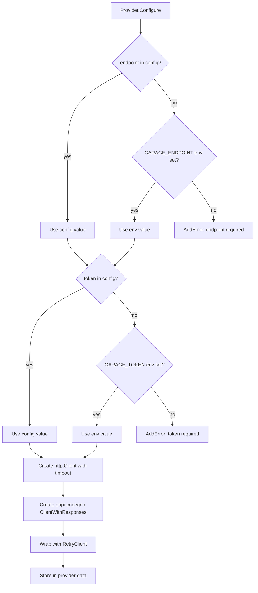

# Plan: Project Scaffold and Generated API Client

This plan covers bootstrapping the `terraform-provider-garage` Go module and generating a type-safe Garage API client from the official OpenAPI v2.2.0 specification. Everything else depends on this.

## Context

Per [ADR-006](../decisions/ADR-006-terraform-provider-scope.md), the provider is a standalone Go module that can be exported to its own repository. The API client is generated from the vendored OpenAPI spec using oapi-codegen — the same approach as the operator. The [existing provider](../research/terraform-provider-analysis.md) uses a hand-rolled client with no timeouts, no retries, and no URL encoding. We fix all of this at the foundation level.

## Scope

### In Scope

- Go module initialization (`go.mod`)
- Entry point (`main.go`) with `providerserver.Serve`
- Provider schema and `Configure()` with endpoint + token + env var fallback
- `GNUmakefile` (build, generate, test, testacc, lint)
- `tools/tools.go` for tool dependencies
- oapi-codegen configuration and generated client
- Client wrapper with configurable timeout, exponential backoff retry, and jitter
- `.goreleaser.yml` for release automation
- `terraform-registry-manifest.json`

### Out of Scope

- Resources and data sources (Plans 02-05)
- Acceptance tests (Plan 06)
- Documentation and Registry publishing (Plan 07)

## Design

### Provider Configuration Schema

```go
type GarageProviderModel struct {
    Endpoint     types.String `tfsdk:"endpoint"`
    Token        types.String `tfsdk:"token"`
    Timeout      types.Int64  `tfsdk:"timeout"`
    MaxRetries   types.Int64  `tfsdk:"max_retries"`
    RetryMinWait types.Int64  `tfsdk:"retry_min_wait"`
    RetryMaxWait types.Int64  `tfsdk:"retry_max_wait"`
}
```

| Attribute | Type | Default | Env Var | Validator | Description |
|---|---|---|---|---|---|
| `endpoint` | String, Required | — | `GARAGE_ENDPOINT` | `stringvalidator.RegexMatches(^https?://)` | Garage Admin API URL |
| `token` | String, Required, Sensitive | — | `GARAGE_TOKEN` | `stringvalidator.LengthAtLeast(1)` | Admin API bearer token |
| `timeout` | Int64, Optional | `30` | `GARAGE_TIMEOUT` | `int64validator.Between(1, 300)` | HTTP timeout in seconds |
| `max_retries` | Int64, Optional | `3` | — | `int64validator.Between(0, 10)` | Max retries on transient failures |
| `retry_min_wait` | Int64, Optional | `1` | — | `int64validator.AtLeast(1)` | Min wait between retries (seconds) |
| `retry_max_wait` | Int64, Optional | `30` | — | `int64validator.AtLeast(1)` | Max wait between retries (seconds) |

### Provider Configure Flow



**Env var precedence:** Config block values take priority over environment variables. If both are set, config wins. This matches Terraform convention (explicit config > implicit env).

**Provider data access:** Resources and data sources access the client via the provider's `Configure()` result, stored as provider meta (private data). Each resource retrieves it in its CRUD methods:

```go
func (r *BucketResource) Create(ctx context.Context, req resource.CreateRequest, resp *resource.CreateResponse) {
    client := r.client // set during resource.Configure(), not request-scoped
    // ...
}
```

The provider stores the client on each resource/data source instance via the `Configure` method on `resource.ResourceWithConfigure` / `datasource.DataSourceWithConfigure`.

### API Client Generation

oapi-codegen generates a type-safe client from the vendored spec:

```yaml
# internal/garage/config.yaml
package: garage
output: client.gen.go
generate:
  client: true
  models: true
  embedded-spec: false
output-options:
  skip-prune: true
```

```go
// internal/garage/generate.go
//go:generate go run github.com/oapi-codegen/oapi-codegen/v2/cmd/oapi-codegen \
//  --config=config.yaml \
//  openapi/spec.json
```

The spec is vendored at `internal/garage/openapi/spec.json` within the provider directory. The `go:generate` directive runs from `internal/garage/`, so `openapi/spec.json` is a relative subdirectory path.

### Client Wrapper

```go
// internal/garage/client.go

// Client wraps the generated oapi-codegen client with operational concerns.
type Client struct {
    inner      *ClientWithResponses
    maxRetries int
    minWait    time.Duration
    maxWait    time.Duration
}

// NewClient creates a Client with the given HTTP client and retry config.
// It constructs an http.Client with the given timeout, creates the oapi-codegen
// ClientWithResponses, and wraps it with retry logic.
func NewClient(endpoint string, token string, opts ...ClientOption) (*Client, error)

// ClientOption configures optional Client behavior.
type ClientOption func(*Client)

func WithTimeout(d time.Duration) ClientOption     // Sets http.Client.Timeout (default: 30s)
func WithMaxRetries(n int) ClientOption             // Sets max retry attempts (default: 3)
func WithRetryWait(min, max time.Duration) ClientOption // Sets backoff bounds (default: 1s-30s)
```

The `Authorization: Bearer <token>` header is injected via oapi-codegen's `WithRequestEditorFn` option, not custom middleware.

**Retry policy:**
- Retry on: 429 (Too Many Requests), 500, 502, 503, 504, connection reset, DNS errors
- Do NOT retry on: 400, 401, 403, 404, 409 (deterministic failures)
- Backoff: exponential with full jitter — `sleep = random(0, min(maxWait, minWait * 2^attempt))`
- 429 responses: respect `Retry-After` header if present

**Error classification:**

```go
type ErrorKind int

const (
    ErrorKindTransient   ErrorKind = iota // 429, 5xx, network — retryable
    ErrorKindNotFound                     // 404 — resource doesn't exist
    ErrorKindConflict                     // 409 — concurrent modification
    ErrorKindValidation                   // 400 — bad request
    ErrorKindAuth                         // 401, 403 — authentication/authorization
    ErrorKindUnknown                      // anything else
)

// Classify returns the ErrorKind for an HTTP status code.
func Classify(statusCode int) ErrorKind

// ClassifyError returns the ErrorKind for a Go error (network errors, DNS, timeouts).
// Falls back to ErrorKindUnknown if the error doesn't match a known pattern.
func ClassifyError(err error) ErrorKind
```

`ClassifyError` detects network-level failures:
- `net.DNSError` → `ErrorKindTransient`
- `syscall.ECONNRESET`, `syscall.ECONNREFUSED` → `ErrorKindTransient`
- `context.DeadlineExceeded` → `ErrorKindTransient`
- Anything else → `ErrorKindUnknown`

Resources use `ErrorKind` to decide behavior:
- `NotFound` on Read → `resp.State.RemoveResource(ctx)` (resource was deleted out of band)
- `Conflict` on layout Apply → retry with fresh version
- `Validation` → `resp.Diagnostics.AddError()` with API error body
- `Auth` → `resp.Diagnostics.AddError("Authentication failed", ...)`

## Acceptance Criteria

- [ ] `go mod tidy` succeeds — all dependencies resolve
- [ ] `go build ./...` produces a valid binary
- [ ] `go generate ./...` generates `client.gen.go` from the vendored OpenAPI spec
- [ ] Generated client has methods for all 49 API operations
- [ ] Provider `Configure()` reads endpoint from config block
- [ ] Provider `Configure()` reads endpoint from `GARAGE_ENDPOINT` env var when config is empty
- [ ] Provider `Configure()` reads token from config block (marked sensitive)
- [ ] Provider `Configure()` reads token from `GARAGE_TOKEN` env var when config is empty
- [ ] Provider returns clear error diagnostic when endpoint is missing
- [ ] Provider returns clear error diagnostic when token is missing
- [ ] HTTP client has configurable timeout (default 30s, verified with test)
- [ ] Retry wrapper retries on 500 with exponential backoff
- [ ] Retry wrapper does NOT retry on 404
- [ ] Retry wrapper respects `max_retries` limit
- [ ] `ErrorKind` classification is correct for all status code ranges
- [ ] `make build` produces a working binary
- [ ] `make generate` regenerates the API client
- [ ] `make lint` passes with golangci-lint
- [ ] `.goreleaser.yml` passes `goreleaser check`

## Implementation Phases

### Phase 1: Module and Build

- [ ] Create `go.mod` with module path `github.com/vhco-pro/terraform-provider-garage`
- [ ] Create `main.go` with `providerserver.Serve` using protocol v6
- [ ] Create `GNUmakefile` with targets: `build`, `generate`, `test`, `testacc`, `lint`, `fmt`
- [ ] Create `tools/tools.go` requiring `oapi-codegen` and `tfplugindocs`
- [ ] Create `terraform-registry-manifest.json` with `protocol_versions: ["6.0"]`
- [ ] Create `.goreleaser.yml` from HashiCorp scaffold template
- [ ] Create `.golangci.yml` with standard linter config
- [ ] Run `go mod tidy`, verify build

### Phase 2: API Client Generation

- [ ] Create `internal/garage/config.yaml` for oapi-codegen
- [ ] Create `internal/garage/generate.go` with `//go:generate` pointing to vendored spec
- [ ] Run `go generate`, verify `client.gen.go` compiles with all 49 operation methods
- [ ] Verify generated types match OpenAPI schemas (spot-check: `GetBucketInfoResponse`, `LayoutNodeRole`, `CreateAdminTokenResponse`)

### Phase 3: Client Wrapper

- [ ] Create `internal/garage/client.go` with `Client` struct wrapping generated client
- [ ] Implement `NewClient()` with endpoint, token, timeout, and retry config
- [ ] Implement HTTP request middleware that injects `Authorization: Bearer <token>` header
- [ ] Implement `Classify()` for error kind determination
- [ ] Implement retry loop with exponential backoff + jitter
- [ ] Implement `Retry-After` header respect for 429 responses
- [ ] Create `internal/garage/client_test.go`:
  - Test: retry on 500, succeeds on 3rd attempt
  - Test: no retry on 404
  - Test: timeout after configured duration
  - Test: respects max_retries limit
  - Test: Classify() returns correct ErrorKind for all status ranges

### Phase 4: Provider Core

- [ ] Create `internal/provider/provider.go` with schema definition
- [ ] Implement `Configure()` with env var fallback and client construction
- [ ] Add validators on all provider attributes
- [ ] `Resources()` returns empty slice (resources added in Plans 02-05)
- [ ] `DataSources()` returns empty slice
- [ ] Create `internal/provider/provider_test.go`:
  - Test: configure with both endpoint and token
  - Test: configure with env vars
  - Test: error when endpoint missing
  - Test: error when token missing
- [ ] Create `examples/provider/provider.tf`

## Test Plan

See [Plan 06 — Testing Strategy](06-testing.md) for complete test definitions.

| Acceptance Criterion | Test ID | Test Type | Location |
|---|---|---|---|
| Module compiles | — | Build | `make build` |
| Client generation | — | Build | `make generate` |
| Retry on 500, succeeds on 3rd | U1 | Unit | `internal/garage/client_test.go` |
| No retry on 400/401/403/404/409 | U2 | Unit | `internal/garage/client_test.go` |
| Max retries limit respected | U3 | Unit | `internal/garage/client_test.go` |
| Timeout after configured duration | U4 | Unit | `internal/garage/client_test.go` |
| Retry-After header respected (429) | U5 | Unit | `internal/garage/client_test.go` |
| Backoff + jitter within bounds | U6 | Unit | `internal/garage/client_test.go` |
| Classify() HTTP status codes | U7 | Unit | `internal/garage/errors_test.go` |
| ClassifyError() network errors | U8 | Unit | `internal/garage/errors_test.go` |
| ClassifyError() unknown fallback | U9 | Unit | `internal/garage/errors_test.go` |
| Provider config from block | PC1 | Acceptance | `provider_test.go` |
| Provider config from env vars | PC2 | Acceptance | `provider_test.go` |
| Provider error on missing endpoint | PC3 | Acceptance | `provider_test.go` |
| Provider error on missing token | PC4 | Acceptance | `provider_test.go` |
| Provider rejects invalid endpoint | PC5 | Acceptance | `provider_test.go` |
| Config block overrides env vars | PC6 | Acceptance | `provider_test.go` |
| GoReleaser config valid | — | Lint | `goreleaser check` |
| Lint passes | — | Lint | `make lint` |

## Resolved Questions

1. **Go module path** — `github.com/vhco-pro/terraform-provider-garage`. Registry namespace: `vhco-pro/garage`.
2. **oapi-codegen version** — Pin to latest stable (v2.4.x at time of writing). Independent from operator.
3. **Spec path on export** — When extracted to standalone repo, copy spec to `internal/garage/openapi/spec.json` and update generate path. Document in README.
