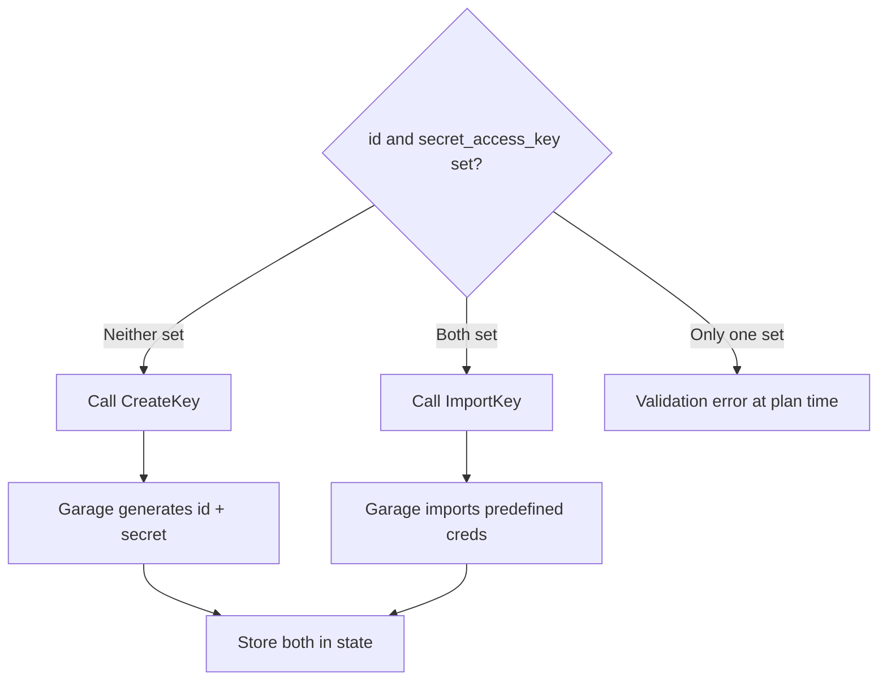

# Plan: Key and Permission Resources

This plan implements Garage access key management (`garage_key` resource, `garage_key` / `garage_keys` data sources) and bucket permission management (`garage_bucket_permission` resource). Permissions are the trickiest part of the provider due to Garage's additive Allow/Deny API.

## Context

The [existing provider](../research/terraform-provider-analysis.md) has a critical key update bug (Update is a no-op — name changes silently dropped) and correctly handles the permission Allow/Deny semantics (the one thing it does well). We must fix the key bug and maintain correct permission handling.

Depends on: [Plan 01 — Project Scaffold](01-project-scaffold.md)

## Scope

### In Scope

- `garage_key` resource — Create (auto-generate + import), Read, Update (actually calls API), Delete
- `garage_bucket_permission` resource — Grant/revoke permissions with correct per-flag diff
- `garage_key` data source — Lookup by ID
- `garage_keys` data source — List all keys
- Secret key handling (retrievable via `showSecretKey=true`, sensitive)

### Out of Scope

- Bucket resource (Plan 02)
- Key-scoped bucket aliases (handled by `garage_bucket_alias` in Plan 02)

## Design

### API Operations Used

| Operation | Used By |
|---|---|
| `CreateKey` | `garage_key` Create (auto-generate mode) |
| `ImportKey` | `garage_key` Create (predefined credentials mode) |
| `GetKeyInfo` | `garage_key` Read + `garage_key` data source |
| `UpdateKey` | `garage_key` Update (name change) |
| `DeleteKey` | `garage_key` Delete |
| `ListKeys` | `garage_keys` data source |
| `AllowBucketKey` | `garage_bucket_permission` Create/Update (grant) |
| `DenyBucketKey` | `garage_bucket_permission` Update (revoke) / Delete |
| `GetBucketInfo` | `garage_bucket_permission` Read (extract permission state) |

### Resource: `garage_key`

#### Schema

| Attribute | Type | Req/Opt/Comp | Plan Modifier | Validator | Description |
|---|---|---|---|---|---|
| `id` | String | Optional/Computed | `UseStateForUnknown`, `RequiresReplaceIfConfigured` | `RegexMatches(^GK[0-9a-f]{24}$)` | Access key ID |
| `secret_access_key` | String, Sensitive | Optional/Computed | `UseStateForUnknown`, `RequiresReplaceIfConfigured` | — | Secret access key |
| `name` | String | Optional | — | `LengthBetween(1, 255)` | Human-friendly name |
| `expiration` | String | Optional | — | RFC 3339 format validator | Key expiration timestamp |
| `never_expires` | Bool | Optional | — | — | Set to `true` to explicitly make the key never expire (conflicts with `expiration`) |
| `expired` | Bool | Computed | — | — | Whether this key has expired (set by Garage) |
| `created` | String | Computed | — | — | Key creation timestamp (RFC 3339) |
| `create_bucket` | Bool | Optional | — | — | Whether this key is allowed to create buckets (via `permissions.createBucket`) |
| `buckets` | List of Object | Computed | — | — | Buckets this key has permissions on |
| `buckets.*.bucket_id` | String | Computed | — | — | Bucket ID |
| `buckets.*.read` | Bool | Computed | — | — | Read permission |
| `buckets.*.write` | Bool | Computed | — | — | Write permission |
| `buckets.*.owner` | Bool | Computed | — | — | Owner permission |

**Cross-attribute validation:** `id` and `secret_access_key` must be both set or both unset. Providing only one is an error.

```go
// Validators on the resource schema
path.MatchRoot("id"): stringvalidator.AlsoRequires(
    path.MatchRoot("secret_access_key"),
),
path.MatchRoot("secret_access_key"): stringvalidator.AlsoRequires(
    path.MatchRoot("id"),
),
```

#### Two Create Flows



**Secret key availability:** The `secret_access_key` IS retrievable after creation via the `showSecretKey=true` query parameter on `GetKeyInfo`. This is a Garage v2 feature.

This means:
- On `terraform import`, the provider calls `GetKeyInfo?id=<key_id>&showSecretKey=true` to retrieve the secret.
- The provider also uses `showSecretKey=true` on every Read to keep the secret in state.
- `UseStateForUnknown` is still used as a fallback, but the secret should normally be available.

**Key expiration/permissions:** The API also supports `expiration`, `neverExpires`, and `permissions { createBucket }` on keys. These are managed via `CreateKey`/`UpdateKey` requests. The `expired` boolean is a computed read-only field.

#### CRUD Implementation

**Create (auto-generate):**
1. Call `CreateKey` with optional `name`, `expiration`, `neverExpires`, `allow/deny { createBucket }` (all fields from `UpdateKeyRequestBody`, since `CreateKeyRequest` = `UpdateKeyRequestBody`)
2. Store returned `accessKeyId` as `id` and `secretAccessKey` as `secret_access_key`

**Create (import predefined):**
1. Call `ImportKey` with `accessKeyId` and `secretAccessKey` (required) and optional `name`
2. If `expiration`, `neverExpires`, or `create_bucket` specified, call `UpdateKey` to set them

**Read:**
1. Call `GetKeyInfo` by ID with `showSecretKey=true`
2. If 404 → remove from state
3. Map `name`, `buckets`, `secret_access_key`, `expired`, `created`, `expiration`, `create_bucket` from response

**Update:**
1. Call `UpdateKey` with changed fields (`name`, `expiration`, `neverExpires`, `allow/deny { createBucket }`)

**Delete:**
1. Call `DeleteKey` by ID

**Import:**
- By key ID (`GKxxxx...`)
- Provider calls `GetKeyInfo?id=<key_id>&showSecretKey=true` to retrieve the full state including `secret_access_key`

---

### Resource: `garage_bucket_permission`

#### Schema

| Attribute | Type | Req/Opt/Comp | Plan Modifier | Validator | Description |
|---|---|---|---|---|---|
| `id` | String | Computed | `UseStateForUnknown` | — | Composite: `{bucket_id}/{access_key_id}` |
| `bucket_id` | String | Required | `RequiresReplace` | `LengthAtLeast(1)` | Target bucket ID |
| `access_key_id` | String | Required | `RequiresReplace` | `RegexMatches(^GK[0-9a-f]{24}$)` | Target key ID |
| `read` | Bool | Optional | — | — | Read permission (default: false) |
| `write` | Bool | Optional | — | — | Write permission (default: false) |
| `owner` | Bool | Optional | — | — | Owner permission (default: false) |

#### Permission Diff Algorithm

The critical design here. Garage's API is **additive**: `AllowBucketKey` grants individual flags (flags set to `false` are **ignored**, not revoked), `DenyBucketKey` revokes individual flags (same semantics). You cannot "set the full permission state" in one call. The Update method must diff old vs new state, then batch all grants into one `AllowBucketKey` call and all revokes into one `DenyBucketKey` call:

```
grants  = {P : P ∈ {read, write, owner} where old[P] == false && new[P] == true}
revokes = {P : P ∈ {read, write, owner} where old[P] == true  && new[P] == false}

if grants  is non-empty → AllowBucketKey(bucket_id, access_key_id, grants)
if revokes is non-empty → DenyBucketKey(bucket_id, access_key_id, revokes)
```

This is safe because `AllowBucketKey({read: true, write: true})` only sets read and write — it does NOT affect owner. Similarly, `DenyBucketKey({owner: true})` only revokes owner. Flags set to `false` in the request body are ignored by the API (they keep their current value).

#### CRUD Implementation

**Create:**
1. Build permission flags from plan (read, write, owner)
2. If any flag is `true`, call `AllowBucketKey` with those flags
3. Construct composite ID: `{bucket_id}/{access_key_id}`

**Read:**
1. Call `GetBucketInfo` for `bucket_id`
2. Find our `access_key_id` in the bucket's `keys` array
3. If not found → remove from state (permission was revoked externally)
4. Map `read`, `write`, `owner` from bucket info

**Update:**
1. Compute grants and revokes from the diff algorithm above
2. If any grants: call `AllowBucketKey` with all granted flags in one request
3. If any revokes: call `DenyBucketKey` with all revoked flags in one request
4. Read back actual state from `GetBucketInfo` to confirm

**Delete:**
1. Read current permissions from `GetBucketInfo`
2. Call `DenyBucketKey` for all currently-true permissions
3. No error if permissions already revoked

**Import:**
- By composite ID `{bucket_id}/{access_key_id}`
- Custom parse logic to split on `/`

#### Example HCL

```hcl
resource "garage_key" "app" {
  name = "application-key"
}

resource "garage_bucket" "data" {
  global_alias = "app-data"
}

resource "garage_bucket_permission" "app_rw" {
  bucket_id     = garage_bucket.data.id
  access_key_id = garage_key.app.id
  read          = true
  write         = true
  owner         = false
}

# Read-only access for a monitoring key
resource "garage_bucket_permission" "monitor_ro" {
  bucket_id     = garage_bucket.data.id
  access_key_id = garage_key.monitor.id
  read          = true
  write         = false
  owner         = false
}
```

---

### Data Source: `garage_key`

#### Schema

| Attribute | Type | Req/Opt/Comp | Description |
|---|---|---|---|
| `id` | String | Required | Key ID to look up |
| `name` | String | Computed | Key name |
| `expired` | Bool | Computed | Whether the key has expired |
| `created` | String | Computed | Key creation timestamp |
| `expiration` | String | Computed | Key expiration timestamp |
| `create_bucket` | Bool | Computed | Whether key can create buckets |
| `buckets` | List of Object | Computed | Buckets with permissions |

**Implementation:** Call `GetKeyInfo` by ID (without `showSecretKey` — data sources should not expose secrets).

**Note:** No `name`-based lookup — Garage's `ListKeys` returns only ID+name pairs with no filtering. To look up by name, use the `garage_keys` data source and filter client-side. This avoids ambiguity when multiple keys have the same name.

#### Example HCL

```hcl
data "garage_key" "existing" {
  id = "GK31c2f218a2e44f485b94239e"
}

output "key_name" {
  value = data.garage_key.existing.name
}
```

---

### Data Source: `garage_keys`

#### Schema

| Attribute | Type | Description |
|---|---|---|
| `keys` | List of Object | All keys |
| `keys.*.id` | String | Key ID |
| `keys.*.name` | String | Key name |
| `keys.*.expired` | Bool | Whether key has expired |
| `keys.*.created` | String | Key creation timestamp |
| `keys.*.expiration` | String | Key expiration timestamp |

**Implementation:** Call `ListKeys`, map response. Note: `ListKeys` returns `id`, `name`, `expired`, `created`, and `expiration` per key (not just ID + name as previously assumed).

#### Example HCL

```hcl
data "garage_keys" "all" {}

output "key_ids" {
  value = [for k in data.garage_keys.all.keys : k.id]
}
```

## Acceptance Criteria

### `garage_key` Resource

- [ ] Create without `id`/`secret_access_key` auto-generates both
- [ ] `secret_access_key` is marked sensitive in plan output
- [ ] `secret_access_key` is preserved across `terraform apply` (UseStateForUnknown)
- [ ] Create with both `id` and `secret_access_key` calls `ImportKey`
- [ ] Create with only `id` (no secret) returns validation error at plan time
- [ ] Create with only `secret_access_key` (no id) returns validation error at plan time
- [ ] Update of `name` persists to Garage (verifiable via `GetKeyInfo` returning the new name)
- [ ] Delete calls `DeleteKey`
- [ ] Import by key ID restores `id`, `name`, `buckets`, and `secret_access_key` (via `showSecretKey=true`)
- [ ] Changing `id` triggers destroy+recreate
- [ ] Changing `secret_access_key` triggers destroy+recreate
- [ ] `id` validated against `^GK[0-9a-f]{24}$` regex

### `garage_bucket_permission` Resource

- [ ] Create with `read = true, write = true` grants both permissions (verifiable via `GetBucketInfo`)
- [ ] Read extracts correct permission state from `GetBucketInfo` response's `keys` array
- [ ] Update adding `write = true` to existing `read = true` only grants write (read unchanged)
- [ ] Update removing `owner = true` revokes owner permission (other flags unchanged)
- [ ] Delete revokes all currently-set permissions
- [ ] Import by `{bucket_id}/{access_key_id}` restores correct `read/write/owner` state
- [ ] Import with malformed ID (no `/` separator) returns clear parse error
- [ ] Validation: `access_key_id` matches `^GK[0-9a-f]{24}$`
- [ ] Permission removed externally → Read removes from state

### Data Sources

- [ ] `garage_key` data source returns key info by ID
- [ ] `garage_key` data source returns error for non-existent key
- [ ] `garage_keys` data source returns list of all keys with ID and name
- [ ] `garage_keys` data source returns empty list when no keys exist

## Implementation Phases

### Phase 1: Key Resource

- [ ] Create `internal/provider/resource_key.go` with schema
- [ ] Implement two Create flows (auto-generate vs import)
- [ ] Implement Read with secret preservation from state
- [ ] Implement Update calling `UpdateKey` for name changes
- [ ] Implement Delete
- [ ] Implement ImportState
- [ ] Add validators (ID regex, cross-attribute id↔secret)
- [ ] Create examples

### Phase 2: Permission Resource

- [ ] Create `internal/provider/resource_bucket_permission.go`
- [ ] Implement permission diff algorithm
- [ ] Implement Create with AllowBucketKey
- [ ] Implement Read extracting perms from GetBucketInfo
- [ ] Implement Update with per-flag diff → Allow/Deny calls
- [ ] Implement Delete with DenyBucketKey for all flags
- [ ] Implement composite ID import
- [ ] Create examples

### Phase 3: Key Data Sources

- [ ] Create `internal/provider/datasource_key.go` — lookup by ID
- [ ] Create `internal/provider/datasource_keys.go` — list all
- [ ] Create examples

### Phase 4: Register and Verify

- [ ] Register all resources and data sources in `provider.go`
- [ ] Verify `make build` succeeds
- [ ] Write unit tests for permission diff algorithm (table-driven)
- [ ] Write unit tests for composite ID parsing

## Test Plan

See [Plan 06 — Testing Strategy](06-testing.md) for complete test definitions.

| Acceptance Criterion | Test ID | Test Type | Location |
|---|---|---|---|
| Key auto-generate | K1 | Acceptance | `resource_key_test.go` |
| Key import with predefined creds | K2 | Acceptance | `resource_key_test.go` |
| Key update name calls API | K3 | Acceptance | `resource_key_test.go` |
| Key secret sensitive in output | K4 | Acceptance | `resource_key_test.go` |
| Key import by ID (secret null) | K5 | Acceptance | `resource_key_test.go` |
| Key secret preserved across applies | K6 | Acceptance | `resource_key_test.go` |
| Key disappears externally | K7 | Acceptance | `resource_key_test.go` |
| Key only id, no secret → error | K8 | Acceptance | `resource_key_test.go` |
| Key only secret, no id → error | K9 | Acceptance | `resource_key_test.go` |
| Key invalid id format → error | K10 | Acceptance | `resource_key_test.go` |
| Permission read-only grant | P1 | Acceptance | `resource_bucket_permission_test.go` |
| Permission read+write grant | P2 | Acceptance | `resource_bucket_permission_test.go` |
| Permission all flags grant | P3 | Acceptance | `resource_bucket_permission_test.go` |
| Permission add write to read | P4 | Acceptance | `resource_bucket_permission_test.go` |
| Permission revoke owner, keep r+w | P5 | Acceptance | `resource_bucket_permission_test.go` |
| Permission import composite ID | P6 | Acceptance | `resource_bucket_permission_test.go` |
| Permission delete revokes all | P7 | Acceptance | `resource_bucket_permission_test.go` |
| Permission disappears externally | P8 | Acceptance | `resource_bucket_permission_test.go` |
| Permission invalid key ID → error | P9 | Acceptance | `resource_bucket_permission_test.go` |
| Permission import malformed ID | P10 | Acceptance | `resource_bucket_permission_test.go` |
| Permission diff algorithm | U10-U15 | Unit | `internal/provider/permission_diff_test.go` |
| Composite ID parse/format | U21-U24 | Unit | `internal/provider/id_parse_test.go` |
| Key data source by ID | D7 | Acceptance | `datasource_key_test.go` |
| Key data source not found | D8 | Acceptance | `datasource_key_test.go` |
| Keys list data source | D9 | Acceptance | `datasource_keys_test.go` |
| Keys list empty | D10 | Acceptance | `datasource_keys_test.go` |

## Resolved Questions

1. **Key update scope** — `UpdateKey` manages `name`, `expiration`, `neverExpires`, and `allow/deny { createBucket }`. Bucket-scoped permissions (read/write/owner) are managed exclusively via `garage_bucket_permission` (single-ownership model). Mixing bucket permission management between `UpdateKey` and the permission resource would create state conflicts.
2. **Secret key on import** — The provider calls `GetKeyInfo` with `showSecretKey=true` to retrieve the full state including `secret_access_key`. No warning diagnostic needed.
