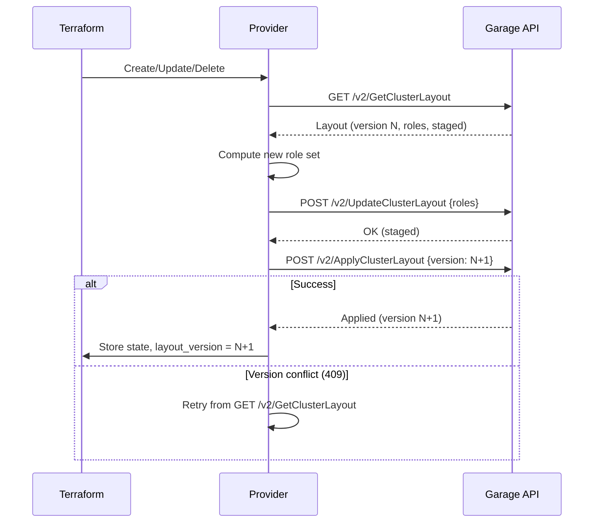

# Plan: Cluster Layout and Data Sources

This plan implements the most complex resource in the provider (`garage_layout_node` — two-phase layout management) and all cluster observability data sources. Layout management is the **primary differentiator** versus the existing provider, which has zero cluster/layout coverage.

## Context

Garage's layout system controls which nodes store data and how it's distributed across zones. Layout changes are two-phase: stage changes via `UpdateClusterLayout`, then apply via `ApplyClusterLayout`. The apply requires a monotonically increasing version number. This is essential for any real Garage deployment and completely missing from the [existing provider](../research/terraform-provider-analysis.md).

Depends on: [Plan 01 — Project Scaffold](01-project-scaffold.md)

## Scope

### In Scope

- `garage_layout_node` resource — Manage a node's role in the cluster layout
- `garage_cluster_layout` data source — Read current layout (version, roles, staged changes)
- `garage_cluster_health` data source — Cluster health metrics
- `garage_cluster_status` data source — Cluster info (version, features, nodes)
- `garage_node_info` data source — Per-node storage and network info

### Out of Scope

- `RevertClusterLayout` — Use `terraform destroy` on `garage_layout_node` instead
- `PreviewClusterLayoutChanges` — Use `terraform plan` instead
- `ClusterLayoutSkipDeadNodes` — Manual recovery action
- `GetClusterLayoutHistory` — Low value for Terraform (future data source candidate)
- `GetClusterStatistics` — Low value for Terraform
- `ConnectClusterNodes` — Imperative bootstrap action

## Design

### API Operations Used

| Operation | Used By |
|---|---|
| `GetClusterLayout` | `garage_layout_node` Read + `garage_cluster_layout` data source |
| `UpdateClusterLayout` | `garage_layout_node` Create/Update (stage) |
| `ApplyClusterLayout` | `garage_layout_node` Create/Update/Delete (apply) |
| `GetClusterHealth` | `garage_cluster_health` data source |
| `GetClusterStatus` | `garage_cluster_status` data source |
| `GetNodeInfo` | `garage_node_info` data source |

### Resource: `garage_layout_node`

Manages a single node's role in the Garage cluster layout.

#### Schema

| Attribute | Type | Req/Opt/Comp | Plan Modifier | Validator | Description |
|---|---|---|---|---|---|
| `id` | String | Computed | `UseStateForUnknown` | — | Same as `node_id` |
| `node_id` | String | Required | `RequiresReplace` | `RegexMatches(^[0-9a-f]{64}$)` | Garage node identifier (64 hex chars) |
| `zone` | String | Required | — | `LengthBetween(1, 255)` | Zone name for data replication |
| `capacity` | Int64 | Optional | — | `AtLeast(1)` when set | Storage capacity in bytes. `null` = gateway node (no storage) |
| `tags` | List of String | Optional | — | — | Node tags for filtering |
| `layout_version` | Int64 | Computed | — | — | Layout version after last apply |

#### Two-Phase Apply Sequence

Every Create, Update, and Delete follows the same pattern:



<details>
<summary>Legend</summary>

- **GetClusterLayout** returns current layout version and all node roles
- **UpdateClusterLayout** stages changes (does not apply them)
- **ApplyClusterLayout** applies staged changes at a specific version (must be current+1)
- Version conflict (409) occurs if another change was applied between our read and apply
- Provider retries up to 3 times on version conflict before failing

</details>

#### CRUD Implementation

**Create:**
1. Get current layout (version N)
2. Stage via `UpdateClusterLayout` with a single role change entry: `{id: node_id, zone, capacity, tags}`
3. Apply via `ApplyClusterLayout` with version N+1
4. If 409 → retry from step 1 (layout changed concurrently)
5. Store state with `layout_version = N+1`

> **API note:** `UpdateClusterLayout` takes an array of individual `NodeRoleChangeRequest` entries. Each entry is oneOf: `{id, zone, capacity, tags}` (add/update a node) or `{id, remove: true}` (remove a node). The provider does NOT need to send a complete role list — only the targeted change. The request also accepts an optional `parameters` field (`LayoutParameters`) to update zone redundancy settings alongside role changes.

**Read:**
1. Get current layout
2. Find node by `node_id` in the layout's roles
3. If not found → `resp.State.RemoveResource(ctx)` (node removed externally)
4. Map zone, capacity, tags from the role

**Update (zone/capacity/tags changed):**
1. Get current layout (version N)
2. Stage via `UpdateClusterLayout` with a single change: `{id: node_id, zone, capacity, tags}` (updated values)
3. Apply version N+1
4. If 409 → retry from step 1
5. Store updated state

**Delete:**
1. Get current layout (version N)
2. Stage via `UpdateClusterLayout` with `{id: node_id, remove: true}`
3. Apply version N+1
4. If 409 → retry

**Import:**
- By node ID
- Read current layout, find node, populate state

#### Concurrency Handling

Multiple `garage_layout_node` resources in a single Terraform config will race because Terraform applies resources in parallel. Each layout operation does read-modify-write on the cluster layout with an optimistic version check.

**Approach: `depends_on` chain + version conflict retry**

Users must chain layout nodes with `depends_on` when defining multiple nodes:

```hcl
resource "garage_layout_node" "node1" {
  node_id  = var.node1_id
  zone     = "dc1"
  capacity = 1099511627776
}

resource "garage_layout_node" "node2" {
  depends_on = [garage_layout_node.node1]
  node_id    = var.node2_id
  zone       = "dc2"
  capacity   = 1099511627776
}
```

The provider also retries on 409 version conflicts (up to 3 times with 1s exponential backoff) as a safety net. This handles rare races even when `depends_on` is used.

**Why not a provider-level mutex:** A mutex would serialize all layout operations transparently, but adds complexity (goroutine-safe provider state), makes debugging harder (silent blocking), and could cause Terraform timeout if many nodes are queued. `depends_on` is explicit and clear.

The `depends_on` requirement will be prominently documented in the resource docs and examples.

#### Example HCL

```hcl
resource "garage_layout_node" "node1" {
  node_id  = "a08b5e87a837acf0dc7e8a84e4034553523b8f083e944b23ba3c4818e92f8e19"
  zone     = "dc1"
  capacity = 1099511627776  # 1 TB
  tags     = ["ssd", "fast"]
}

resource "garage_layout_node" "node2" {
  node_id  = "b18c6f98b948bdf1ed8f9b95f5145664634c9f194f055c34c26d03f576e48a2b"
  zone     = "dc2"
  capacity = 1099511627776  # 1 TB
  tags     = ["hdd", "bulk"]
}
```

---

### Data Source: `garage_cluster_layout`

#### Schema

| Attribute | Type | Description |
|---|---|---|
| `version` | Int64 | Current layout version |
| `roles` | List of Object | Active node roles |
| `roles.*.node_id` | String | Node identifier |
| `roles.*.zone` | String | Zone name |
| `roles.*.capacity` | Int64 | Capacity in bytes (null for gateway nodes) |
| `roles.*.usable_capacity` | Int64 | Usable capacity (after replication overhead) |
| `roles.*.stored_partitions` | Int64 | Number of partitions stored on this node |
| `roles.*.tags` | List of String | Node tags |
| `staged_role_changes` | List of Object | Pending staged changes (not yet applied). Each entry is either `{node_id, zone, capacity, tags}` (add/update) or `{node_id, remove: true}` (remove). |
| `staged_parameters` | Object | Pending parameter changes (null if none staged) |
| `staged_parameters.zone_redundancy` | String/Object | Staged zone redundancy (see `zone_redundancy` type) |
| `partition_size` | Int64 | Size of each partition in the layout |
| `parameters` | Object | Layout computation parameters used for the current layout |
| `parameters.zone_redundancy` | String/Object | Zone redundancy setting: either the string `"maximum"` or an object `{ at_least: integer }`. Maps from API's `ZoneRedundancy` oneOf type. |

**Implementation:** Call `GetClusterLayout`, map response.

#### Example HCL

```hcl
data "garage_cluster_layout" "current" {}

output "layout_version" {
  value = data.garage_cluster_layout.current.version
}

output "node_count" {
  value = length(data.garage_cluster_layout.current.roles)
}
```

---

### Data Source: `garage_cluster_health`

#### Schema

| Attribute | Type | Description |
|---|---|---|
| `status` | String | Overall health status |
| `known_nodes` | Int64 | Total known nodes |
| `connected_nodes` | Int64 | Currently connected nodes |
| `storage_nodes` | Int64 | Nodes with storage role |
| `storage_nodes_up` | Int64 | Healthy storage nodes (from `storageNodesUp`) |
| `partitions` | Int64 | Total partition count |
| `partitions_quorum` | Int64 | Partitions with quorum |
| `partitions_all_ok` | Int64 | Fully healthy partitions |

**Implementation:** Call `GetClusterHealth`, map response.

#### Example HCL

```hcl
data "garage_cluster_health" "current" {}

output "cluster_healthy" {
  value = data.garage_cluster_health.current.storage_nodes == data.garage_cluster_health.current.storage_nodes_up
}
```

---

### Data Source: `garage_cluster_status`

#### Schema

| Attribute | Type | Description |
|---|---|---|
| `layout_version` | Int64 | Current layout version |
| `nodes` | List of Object | All known cluster nodes |
| `nodes.*.id` | String | Node ID |
| `nodes.*.is_up` | Bool | Whether the node is currently reachable |
| `nodes.*.draining` | Bool | Whether the node is being drained |
| `nodes.*.addr` | String | Network address |
| `nodes.*.hostname` | String | Node hostname |
| `nodes.*.garage_version` | String | Garage version running on this node |
| `nodes.*.last_seen_secs_ago` | Int64 | Seconds since last seen (null if current node) |
| `nodes.*.role` | Object | Node's role in the layout (null if no role assigned) |
| `nodes.*.role.zone` | String | Zone name |
| `nodes.*.role.capacity` | Int64 | Storage capacity (null for gateway nodes) |
| `nodes.*.role.tags` | List of String | Node tags |
| `nodes.*.data_partition` | Object | Data partition info (null if not available) |
| `nodes.*.data_partition.available` | Int64 | Available space |
| `nodes.*.data_partition.total` | Int64 | Total space |
| `nodes.*.metadata_partition` | Object | Metadata partition info (null if not available) |
| `nodes.*.metadata_partition.available` | Int64 | Available space |
| `nodes.*.metadata_partition.total` | Int64 | Total space |

**Implementation:** Call `GetClusterStatus`, map response. Returns `layoutVersion` and a `nodes[]` array with per-node connectivity, role, and partition info.

---

### Data Source: `garage_node_info`

#### Schema

| Attribute | Type | Req/Opt/Comp | Description |
|---|---|---|---|
| `node_id` | String | Optional | Node ID to query. If unset, returns info for all nodes connected to the API endpoint. |
| `nodes` | List of Object | Computed | Node info results |
| `nodes.*.node_id` | String | Computed | Node identifier |
| `nodes.*.garage_version` | String | Computed | Garage software version |
| `nodes.*.rust_version` | String | Computed | Rust compiler version used to build Garage |
| `nodes.*.db_engine` | String | Computed | Database engine name |
| `nodes.*.garage_features` | List of String | Computed | Enabled feature flags |

**Implementation:** Call `GetNodeInfo` with optional `node_id` query parameter. The API returns a `MultiResponse` with `success` (map of node_id → `LocalGetNodeInfoResponse`) and `error` (map of node_id → error message). If `node_id` is specified, filter the `success` map to just that node and return a single-element list (return an error diagnostic if the node is in the `error` map or absent). If `node_id` is unset, return all nodes from the `success` map. Nodes in the `error` map are omitted from results but logged as warnings.

## Acceptance Criteria

### `garage_layout_node` Resource

- [ ] Create stages node role and applies layout (version increments)
- [ ] `layout_version` in state matches applied version
- [ ] Update zone calls stage+apply with modified role
- [ ] Update capacity calls stage+apply with modified capacity
- [ ] Update tags calls stage+apply
- [ ] Delete removes node from layout and applies
- [ ] Version conflict (409) is retried automatically (up to 3 times with exponential backoff)
- [ ] Import by node ID restores zone, capacity, tags, layout_version from current layout
- [ ] Node removed externally → Read removes from state
- [ ] Multiple `garage_layout_node` resources with `depends_on` chain apply sequentially without conflicts

### Cluster Data Sources

- [ ] `garage_cluster_layout` returns current version and all node roles
- [ ] `garage_cluster_layout` includes staged changes if any
- [ ] `garage_cluster_health` returns all health metrics (nodes, partitions, quorum)
- [ ] `garage_cluster_status` returns layout version and node list with role/partition/connectivity info
- [ ] `garage_cluster_status` includes `draining`, `is_up`, `last_seen_secs_ago`, and `role` per node
- [ ] `garage_node_info` returns node info (garage_version, rust_version, db_engine, garage_features) as a list of node objects
- [ ] `garage_node_info` with `node_id` filters to a single node
- [ ] `garage_node_info` without `node_id` returns all nodes from MultiResponse

## Implementation Phases

### Phase 1: Layout Node Resource

- [ ] Create `internal/provider/resource_layout_node.go` with schema
- [ ] Implement two-phase Create (GetLayout → Stage → Apply)
- [ ] Implement Read (GetLayout → find node)
- [ ] Implement two-phase Update
- [ ] Implement two-phase Delete
- [ ] Implement version conflict retry (409 → re-read layout, retry up to 3 times, 1s × 2^attempt backoff)
- [ ] Implement ImportState (read current layout, find node by ID, populate zone/capacity/tags)
- [ ] Add validators (node_id length, zone length, capacity positive)
- [ ] Create examples

### Phase 2: Layout Data Source

- [ ] Create `internal/provider/datasource_cluster_layout.go`
- [ ] Map full response including staged changes
- [ ] Create examples

### Phase 3: Cluster Data Sources

- [ ] Create `internal/provider/datasource_cluster_health.go`
- [ ] Create `internal/provider/datasource_cluster_status.go`
- [ ] Create `internal/provider/datasource_node_info.go`
- [ ] Create examples for all three

### Phase 4: Register and Verify

- [ ] Register all resources and data sources in `provider.go`
- [ ] Verify `make build` succeeds
- [ ] Write unit test for version conflict retry logic
- [ ] Write unit test for role-set computation (add/modify/remove node)

## Test Plan

See [Plan 06 — Testing Strategy](06-testing.md) for complete test definitions.

| Acceptance Criterion | Test ID | Test Type | Location |
|---|---|---|---|
| Layout node create + apply | L1 | Acceptance (serial) | `resource_layout_node_test.go` |
| Layout node update zone | L2 | Acceptance (serial) | `resource_layout_node_test.go` |
| Layout node update capacity | L3 | Acceptance (serial) | `resource_layout_node_test.go` |
| Layout node update tags | L4 | Acceptance (serial) | `resource_layout_node_test.go` |
| Layout node import | L5 | Acceptance (serial) | `resource_layout_node_test.go` |
| Layout node delete | L6 | Acceptance (serial) | `resource_layout_node_test.go` |
| Layout node disappears externally | L7 | Acceptance (serial) | `resource_layout_node_test.go` |
| Layout invalid node_id short | L8 | Acceptance (serial) | `resource_layout_node_test.go` |
| Layout invalid node_id uppercase | L9 | Acceptance (serial) | `resource_layout_node_test.go` |
| Layout invalid capacity zero | L10 | Acceptance (serial) | `resource_layout_node_test.go` |
| Role-set add/modify/remove | U16-U18 | Unit | `internal/provider/layout_helpers_test.go` |
| Version conflict retry (success) | U19 | Unit | `internal/provider/layout_helpers_test.go` |
| Version conflict max retries | U20 | Unit | `internal/provider/layout_helpers_test.go` |
| Node ID regex validation | U34 | Unit | `internal/provider/validators_test.go` |
| Cluster layout data source | D13 | Acceptance | `datasource_cluster_layout_test.go` |
| Cluster layout after apply | D14 | Acceptance | `datasource_cluster_layout_test.go` |
| Cluster health data source | D11 | Acceptance (serial) | `datasource_cluster_health_test.go` |
| Cluster status data source | D12 | Acceptance (serial) | `datasource_cluster_status_test.go` |
| Node info data source (all nodes) | D19 | Acceptance (serial) | `datasource_node_info_test.go` |
| Node info data source (by node_id) | D20 | Acceptance (serial) | `datasource_node_info_test.go` |

## Resolved Questions

1. **Concurrency model** — Using `depends_on` chain for sequencing + 409 version conflict retry as safety net. No provider-level mutex (too complex, hard to debug).
2. **Node ID format** — Validate `^[0-9a-f]{64}$` (64 hex chars). Garage consistently uses this format. Strict validation catches typos at plan time.
3. **Layout apply failure recovery** — If stage succeeds but apply fails, the staged changes are left pending. The provider reports the error clearly: "Layout staged but apply failed. Run `terraform apply` again or use Garage CLI to revert staged changes." No automatic revert.
4. **Multi-node endpoints** — `GetNodeInfo` returns a `MultiResponse` with `success` (map of node_id → node info) and `error` (map of node_id → error message). The data source accepts an optional `node_id` input. If provided, it filters to that node from `success` (errors if in the `error` map). If omitted, it returns all nodes from `success`, logging warnings for nodes in the `error` map.
